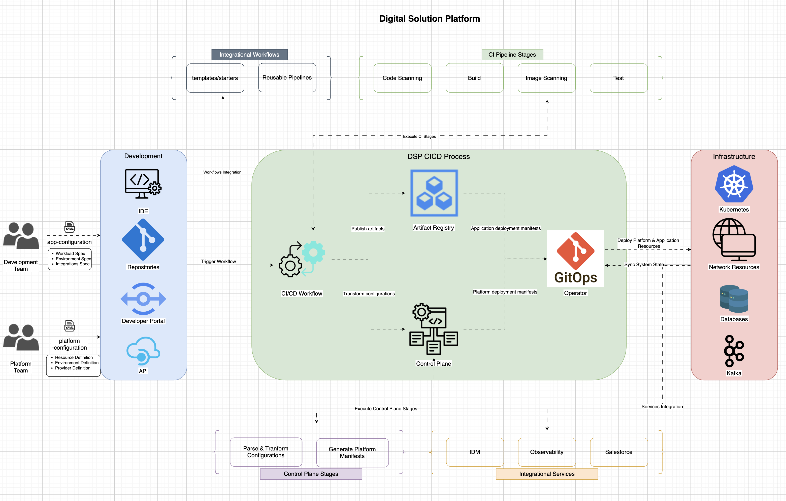
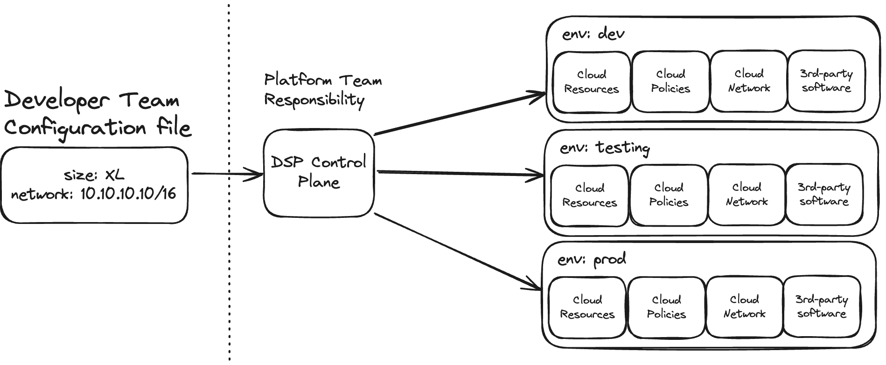
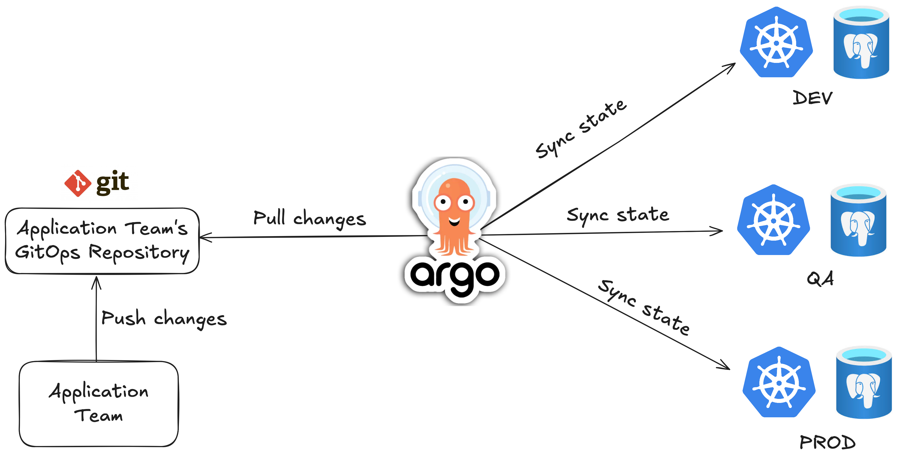

[&larr; back to Overview](/dsp)

**This document will evolve based on future releases**

# DSP - Digital Solution Platform

As DSP, we enable the Vaillant Group to use UI, CLI, IDE,
to easily develop new applications in standarized way.

With the DSP, cluster and application deployment will be easier,
as it come with a standarized way of doing that,
with a set of tools and best practices prebuilt.

Key benefits of DSP:
1. Developer Enablement - Developers can focus on writing code, not on setting up infrastructure. Developers can spin up Kubernetes clusters confidentely, reducing risk of misconfiguration or errors.
2. Organizational efficiency - Standarized way of deploying applications, with a set of tools and best practices prebuilt.

The problem of incosistent environment is solved with standarization process,
developers may apply the same process to all environments,
and the process is repeatable.

By using a standard process,
the risk of misconfiguration or errors is reduced,
the processes follow best practices,
and security patches are applied by DSP Team to all clusters.

---

# Development Environment (Developer Tools provided by DSP)
1. Application Config File (YAML) - describes the application, developers want to deploy. We take care of the logic, behind it. Developers can focus on writing code, not on setting up infrastructure.
2. Platform Config files - describes the platform, where the application will be deployed. Developers just specify what resources do they need, and we take care of the rest. (e.g. Postgres database, Redis cache, Java application, etc.)
3. Future: Developer Portal - in future, will be a place where developers can see their applications, and manage them using UI.

---

# What we offer?
1. Standarized CI/CD pipelines (GitHub Workflows) - [Reusable Workflows Repository](https://github.com/Digital-Solutions-Foundation/reusable-workflows).
2. Automated Infrastructure Provisioning via Application Config Files, Platform Config Files, in future Developer Portal. [Link to repository with Config Files](https://github.com/Digital-Solution-Platform/gitops-digital-solution-platform)
3. Automated application deployment across multi environments using GitOps approach.

### Infrastructure

On a very high level,
we provide infrastructure like shared Kubernetes Resources (clusters, databases, etc) of one Cotrol Plane and multiple Environment Clusters,
which are Kubernetes clusters assigned to indivdual Tenants like VI-..., IR-...
These clusters are shared across multiple teams (projects) with namespaces for each environment.

The Spokes interact with Control Plane,
to collect source of truth,
to have a standarization across all clusters and applications in our organization.

The Spoke Clusters have implemented self-healing mechanisms,
and are monitored by the hub,
which makes them more reliable.

The Control Plane is responsible for deploying workloads into the spokes,
as well as provisioning new spokes.

---

## High level architecture of DSP

Image above shows how we want to formulate the configuration file from the Developer input, for e.g. cloud resources.

See more at [our Confluence Page](https://groupspace.vaillant-group.com/display/VIXP/Digital+Solution+Platform+Architecture).

# Technical Overview

Teams have:
- application code repo (for code of application)
- application gitops repo (for configuration of infrastructure)

Application code repo is a place,
where developers write magic configuration files,
which are then used by the DSP to provision infrastructure.

Application gitops repo is a place,
where developers write configuration files,
which are then used by the DSP to deploy applications.

### How does it work?

#### Configuration Changes:
The application team pushes configuration changes to their GitOps repository. 
This repository contains application configurations as well as infrastructure definitions, 
including Crossplane claims for Azure PostgreSQL Flexible Server.

#### ArgoCD Sync:
ArgoCD is configured to pull changes from the GitOps repository at regular intervals (e.g., every 3 minutes).
ArgoCD monitors the repository for any changes.

#### State Synchronization:
When ArgoCD detects changes in the repository, it synchronizes the state of the Kubernetes cluster with the desired state defined in the repository.
This includes deploying applications and provisioning infrastructure resources.

#### Resource Provisioning with Crossplane:
If the GitOps repository contains Crossplane claims (e.g., for Azure PostgreSQL Flexible Server), ArgoCD triggers Crossplane to provision these resources in Azure.
Crossplane manages the lifecycle of the infrastructure resources based on the claims defined in the repository.

#### Secret Management:
Once the resources are provisioned, Crossplane automatically creates Kubernetes secrets with details like database connection information.
These secrets are stored in the Kubernetes cluster and can be accessed by the applications as needed.

By following these steps, ArgoCD ensures that the state of the applications and infrastructure in the Kubernetes cluster is always in sync with the desired state defined in the GitOps repository.
You can find the flow diagram below:

If you want to see an example structure of the application gitops repo see
[DSP MVP GitOps Repository](https://github.com/Digital-Solution-Platform/gitops-digital-solution-platform).
