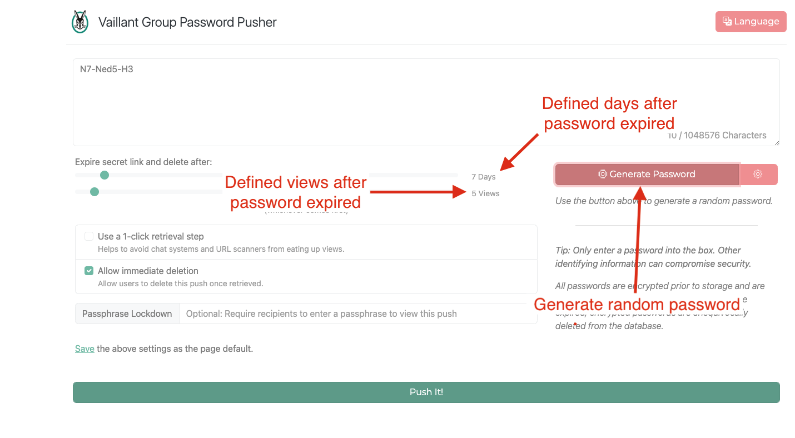

[&larr; back to Overview](/pwpush)

## What is password pusher and for what does it stand for?

Password Pusher is a tool used for sharing securely passwords and other sensitive information.
You can create a unique, one-time URL that will expire after a certain amount of time, 
or after it has been accessed a certain number of times via Password Pusher.
Once expired passwords, are unequivocally deleted.

Application is as a better alternative to emailing passwords.
It avoids having passwords exist in email archives in perpetuity. It does not exist as a end-all security solution.

#### Vaillant Group Password Pusher page:

[Vaillant Group Password Pusher](https://pw.dsp.vaillant-group.com/)

## Quick overview

## Documentation

For more details check:
* [Password Pusher About](https://pwpush.com/en/pages/about)
* [Password Pusher FAQ](https://pwpush.com/en/pages/faq)
